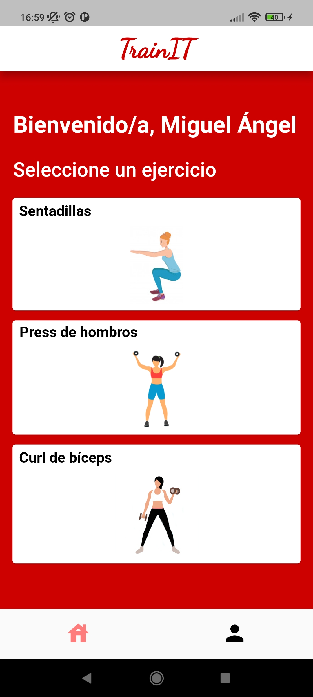
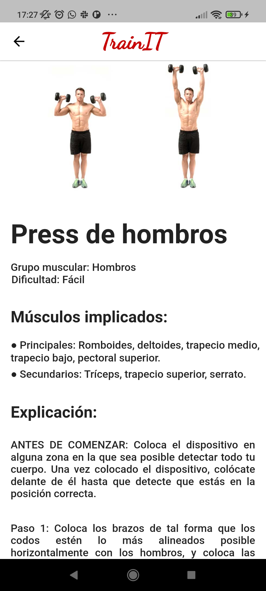
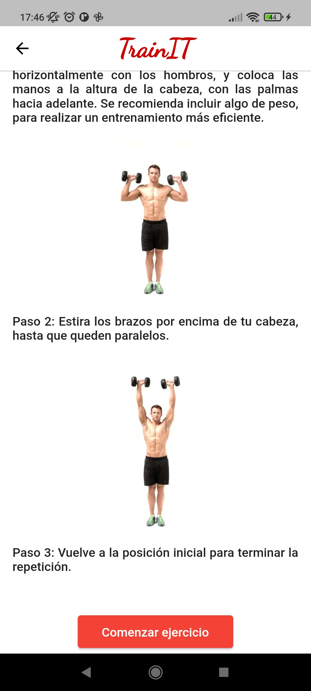
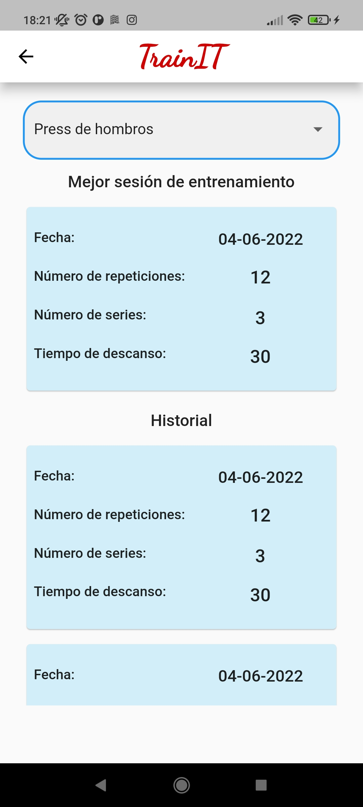

# TrainIT
TrainIT is a Android application that can tell if a user is doing a specific gym exercise correctly using TensorFlow pose estimation model.   
{: height="75px" width="300px" style="float:left; padding-right:10px" }

   

 

On home screen user can select a exercise, and the application show information about it.

   

 
On profile screen you can check stadistic information about training sessions.

   

 

https://user-images.githubusercontent.com/43370438/183715982-eb5b3989-be73-4feb-a80b-b2150686de7c.mp4

https://user-images.githubusercontent.com/43370438/183716951-2e33d38b-5c4c-4bca-b39d-45b7a65bebbd.mp4

https://user-images.githubusercontent.com/43370438/183717428-84b02c7d-987c-4313-becf-ae93bf85c07b.mp4

This app was implemented using Flutter for a Computer Engineering Final Degree Project at the University of Cordova. If you want to see more, click here to download[ click here to download]( https://1drv.ms/u/s!Asdu4nsiDEAbgkQKBl3fSzv__rqF?e=6i06if).
