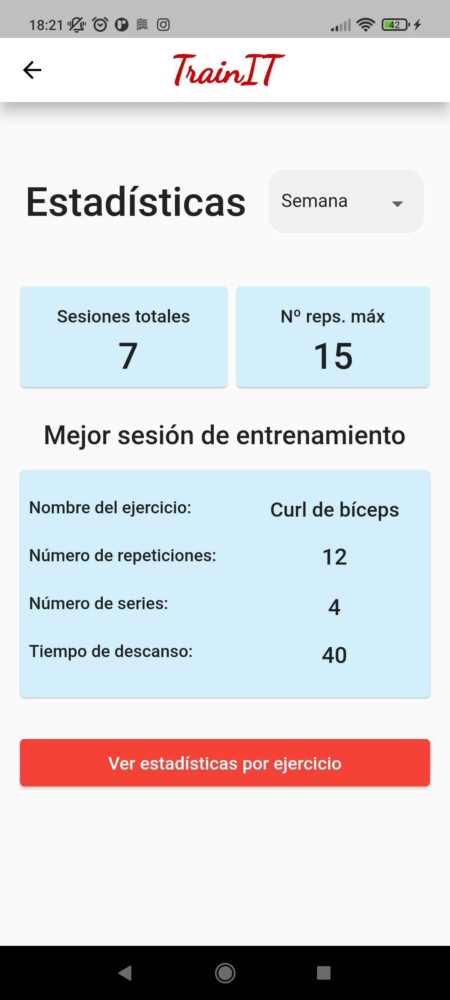

# TrainIT
TrainIT is an Android application capable of detecting whether a user is performing a given gym exercise with the correct technique, by using the TensorFlow pose estimation model.   

   

 

On home screen user can select a exercise, and the application show information about it.

   

 

On profile screen you can check stadistic information about training sessions.

   

 

https://user-images.githubusercontent.com/43370438/183717428-84b02c7d-987c-4313-becf-ae93bf85c07b.mp4

This app was implemented using Flutter for a Computer Engineering Final Degree Project at the University of Cordova. If you want to see more, [ click here to download]( https://1drv.ms/u/s!Asdu4nsiDEAbgkQKBl3fSzv__rqF?e=6i06if).
